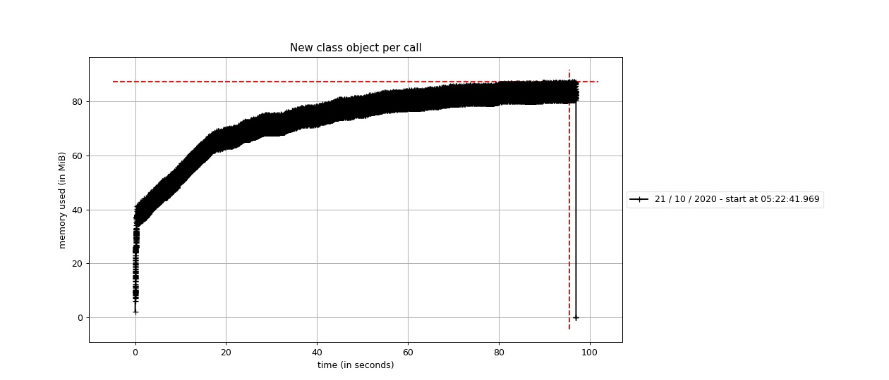

# Decorators vs. Object init

Invoking a decorator vs. creating a new object because the result of the decorator/dependency needs to be passed to the target function and the decorator/dependency should take in arguments without changing the
schema of the FastAPI endpoint that uses the dependency/decorator.

Test conducted to see if new object creation is less memory efficient.

Test needed to select the most efficient JWT authentication mechanism for FastAPI endpoints. Either through the `fastapi.Depends(MyObj(my_param="some value").verify_jwt)` way or through a Python decorator.

## Usage

```bash
python3.7 -m pip install -r requirements.txt
./mem_test.sh
```

## Results

Memory usage was the similar but decorators are slower.

```text
mprof: Sampling memory every 0.0005s
running new process
INFO:root:[+] Running object/per call test.
INFO:root:Peak RSS memory usage: 80380 kB
INFO:root:Execution time for 1000 calls: 9.631143831997178s
Using last profile data.

mprof: Sampling memory every 0.0005s
running new process
INFO:root:[+] Running decorator per call test.
INFO:root:Peak RSS memory usage: 33512 kB
INFO:root:Execution time for 1000 calls: 1.2871662839897908s
Using last profile data.
```




## System stats

```text
Linux dev 4.15.0-121-generic #123-Ubuntu SMP Mon Oct 5 16:16:40 UTC 2020 x86_64 x86_64 x86_64 GNU/Linux

Intel(R) Xeon(R) CPU E5-2630 v2 @ 2.60GHz X 12
stepping        : 4
microcode       : 0x42e
cpu MHz         : 2907.421
cache size      : 15360 KB

MemTotal: 115438636 kB

```